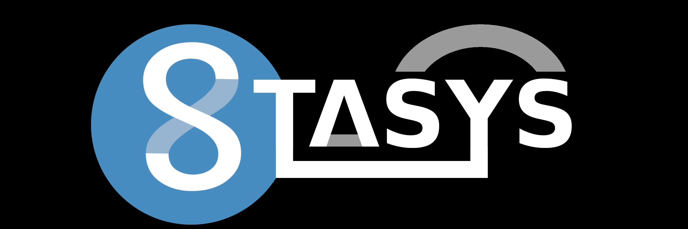

> [!CAUTION]
> **This project is in pre-alpha phase.**
>> [The Maintainer](https://github.com/megalisp) Has Stasys on a 2-4 machines but doesn't daily-drive it atm. Please don't use this yet!


<p align="center">
  
</p>


<div align="center">
      <p>(<strong>Note:</strong> We're waiting... and waiting... and waiting...for?)
</p>
</div>


<div align="center">

  <a href="#" title="Stable Images">
    
  </a>

  <a href="#" title="Latest Images">
    
  </a>

  <a href="#" title="ISO Builds">
    
  </a>

  <a href="#" title="Stasys GHCR Pulls">
    
  </a>

</div>


#### ⚠️ TLDR

> <div align="center">
> <strong><a href="https://godotengine.org">Godot Based</a> <code>Developer Experience</code> x <code>Desktop Environment</code> <a href="https://bootc-dev.github.io/bootc/">Bootc Image</a> .
> </div>


</br>

---


### 💡 THE BIG IDEA
***Add What's The Big Idea***


---

### 🤔 THE FAQS
***Add just the faqs***


---


### 🖼️ Screenshots

**Coming Soon...**


---


### 🚧 Milestones

<p align="center">

<table>
  <thead>
    <tr>
      <th width="5%">✓</th>
      <th width="15%">Milestone</th>
      <th width="80%">Description</th>
    </tr>
  </thead>
  <tbody>
    <tr>
      <td>✅</td>
      <td><strong>Builds</strong></td>
      <td><code>stasys</code> successfully builds via <code>bootc</code> and publishes to <code>ghcr.io</code> container registry using GitHub Actions.</td>
    </tr>
    <tr>
      <td>🟡</td>
      <td><strong>First-Steps.</strong></td>
      <td>Support a graphical session (Hyprland). Have  Godot installed by default & runnable via our image.</td>
    </tr>
    <tr>
      <td>🔲</td>
      <td><strong>Fleshing out</strong></td>
      <td>Flesh out the default session; Make it a first-class development and even desktop experience for Godot.</td>
    </tr>
    <tr>
      <td>🔲</td>
      <td><strong>Onboarding</strong></td>
      <td>Should boot into a first-startup config session app to make a user from default, and various other things</td>
    </tr>
    <tr>
      <td>➕</td>
      <td><strong>And More</strong></td>
      <td>But until we get to this point, I don't even see it as "minimally viable product" status.</td>
    </tr>
  </tbody>
</table>
</div>


---


## ⚡ Getting Started
(Currently you'll need some familarity with either containers and/or Fedora Atomic Desktops. This is something we hope to ease long-term with providing ISOs and VM images as-well as what we have now.)

### Rebase from an existing Fedora Atomic install

If you're already on Silverblue, Bluefin, Kinoite, Bazzite, Aurora, or the like:

    rpm-ostree rebase ostree-unverified-registry:ghcr.io/megalisp/stasys:latest


## OR

### Try in a container

    podman run --rm -it ghcr.io/megalisp/stasys:latest bash

## Preferably,
### Run it via distrobox
(For just-works support for stuff like Dr.Racket)

      distrobox create --name stasys --image ghcr.io/megalisp/stasys:latest
      distrobox enter stasys


Note: We don't have a good way to launch the full graphical-environment from the hosted contianer yet.


---


## 🌟 Related Projects

&nbsp;&nbsp;&nbsp;&nbsp;⭐️ [**gundwm**](https://github.com/megalisp/gundwm)  
&nbsp;&nbsp;&nbsp;&nbsp;&nbsp;&nbsp;&nbsp;&nbsp;&nbsp;&nbsp;Opinionated Hyprland-Config For Stasys x Godot.

&nbsp;&nbsp;&nbsp;&nbsp;⭐️ [**strats**](https://github.com/megalisp/strats)  
&nbsp;&nbsp;&nbsp;&nbsp;&nbsp;&nbsp;&nbsp;&nbsp;&nbsp;&nbsp;Misc Tools For Stasys; Seperate Repo To Test Things Build Extensively Before Updated In-Image.

&nbsp;&nbsp;&nbsp;&nbsp;⭐️ [**cryo**](https://github.com/megalisp/cryo)  
&nbsp;&nbsp;&nbsp;&nbsp;&nbsp;&nbsp;&nbsp;&nbsp;&nbsp;&nbsp;Is Misc Parts Of The Underlying `OS` For STASYS; The Installer, Recovery Tool, Other Misc Utils, Etc.


---


## 🙌 Acknowledgments

- 🤖 [Godot](https://godotengine.org) — for providing an engine to do just-about everything in
- 💧 [Hyprland](https://hyprland.org) — for the next-gen, uber-riceable Wayland compositior and friends. 
- 💙 [Universal Blue](https://universal-blue.org) — for making the container ecosystem so approachable on 'desktop linux'
- ⚛️ [Fedora Atomic](https://fedoraproject.org/atomic-desktops/) - for the underlying project, initiative that we're running on-top of
- 📦 [bootc](https://bootc-dev.github.io/bootc/) — for making bootable containers real / viable in the first-place.
- 🌐 [Everyone & Anyone Else]() - for the literal 1000s of people and projects that made this one possible. o7


---


## ⁉️ Known Issues 


- **Built-in NVIDIA support is far too complicated.** At present, getting NVIDIA drivers working as part of the container is a complex process. We're intending to ship a Justfile command to make layering much easier in the interim.

- SDDM doesn't automatically create a `sddm` user on new installs. You must manually create the `sddm` user for new users at the moment. This is a temporary workaround and will be automated in future releases.
    - To create the `sddm` user, run:
      ```bash
      sudo useradd -r -s /usr/sbin/nologin sddm
      sudo passwd -l sddm
      ```

---


## 📊 Analytics
<div align="center"> 
  <a href="https://github.com/megalisp/statsys " title="Repobeats Analytics">
    
  </a>

<a href="https://star-history.com/#megalisp/stasys&Date">
  <picture>
    <source media="(prefers-color-scheme: dark)" srcset="https://api.star-history.com/svg?repos=megalisp/stasys&type=Date&theme=dark" />
    <source media="(prefers-color-scheme: light)" srcset="https://api.star-history.com/svg?repos=megalisp/stasys&type=Date" />
    
  </picture>
</a>
</div>
